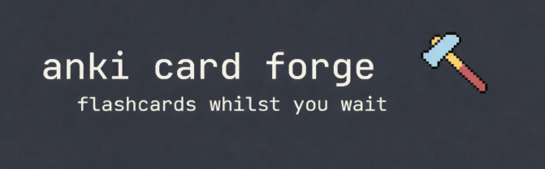
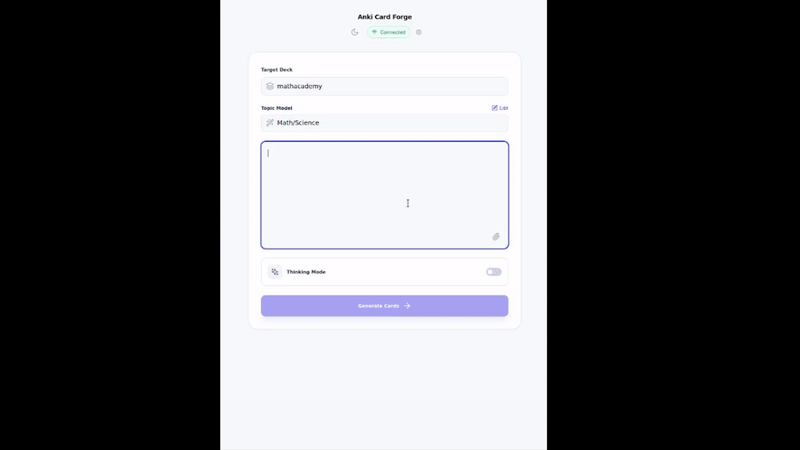

<div align="center">

</div>

<div align="center">

</div>

**Anki Card Forge** uses AI to transform notes/study materials/random screenshots into high-quality, structured Anki flashcards. If you are not familiar with Anki, it is a spaced repetition tool that helps you remember things (there are lots of good resources out to explain this better - see https://augmentingcognition.com/ltm.html). 

Anki is a much-used and much-loved app and there are lots of different views regarding the best or most effective way to use it. For me, Anki has always been a tool for _remembering_ things rather than learning them (if I don't understand a topic, then reviewing lots of flashcards on it is unlikely to be helpful). And `Anki Card Forge` is simply a way of turning things you've learned into nicely formatted flashcards with minimal effort. 

To be very clear up front, this app is entirely AI-generated (down to the terrible name it came up with that I couldn't be bothered to change). The initial draft was done with Google AI Studio (which is why it's set up to work with Gemini) and was then refined a bit with Claude Code. I have been using this myself for a couple months now without any real issues. In general, I have found that Google's AI Studio does a decent job, especially if you then run the app through a couple code reviews. But if you hate AI slop, or if you have concerns with AI-generated code etc. then this is obviously not the app for you!

## Features

Anki Card Forge is built to produce high-quality flashcards and then sync them to Anki using the AnkiConnect API. It makes use of lots of custom prompting (which you can edit), which I have refined over the last couple years of trying to get AI to produce decent flashcards. It incorporates lessons learned from lots of very clever people (Michael Nielsen, already linked above, is an excellent resource on spaced repetition, this article https://disputant.medium.com/how-to-make-better-anki-flashcards-principles-for-high-yield-questions-d58cc7244a7c is also very good). Parts of these prompts will be tailored specifically to me (i.e. regarding formatting), but I think some of the included principles are useful for everyone (i.e. make flashcards atomic, avoid yes/no answers). But it is up to you if you want to delete them entirely and do your own thing. 

Where I think this app delivers real value over just asking an AI to generate loads of cards for you is: it syncs seamelssly via AnkiConnect, and (even better) it gives you a review pane so you can approve/reject/edit suggested cards and filter out any poor suggestions. 

| Feature | Description |
| :--- | :--- |
| **AI-Powered Generation** | Uses Gemini API to generate structured flashcards from unstructured text notes. |
| **Topic Optimization** | Includes specialized (handcrafted) prompts for General, Math/Science (with LaTeX guidance), Vocabulary, and Programming. |
| **Multimodal Support** | Ability to upload images/screenshots alongside notes for card generation. | 
| **Deep Thinking Mode** | An optional mode to engage extended AI reasoning (using Pro rather than Flash) for complex or ambiguous topics (but can take ages). |
| **Direct Anki Sync** | Instantly sends approved cards to your running Anki instance via AnkiConnect. |
| **Review & Edit Workflow** | Provides a dedicated interface to review, edit, and approve each generated card before syncing. |

However, be warned that the card generation process is _slooow_ (I sped this up in the demo video to make it an acceptable length). I normally have it open to the side whilst I'm working so I can click generate, carry on studying, come back to it to review, and repeat, and that seems to work well. 

## Getting Started

### Prerequisites

Before using Anki Card Forge, you need the following:

1.  **Anki** with the **[AnkiConnect](https://ankiweb.net/shared/info/2055492159)** add-on installed and running (AnkiConnect requires Anki to be running)
2.  **Gemini API Key** - Get a key from **[Google AI Studio](https://aistudio.google.com/apikey)**. You will get billed monthly for usage, though it's typically not much. 

### Installation

Anki Card Forge is an Electron app, so it will hopefully work across platforms, but I have only thoroughly tested on my own Linux machine.

#### Option 1: Pre-built Binaries

The easiest way to get started is by downloading the pre-built application for your platform from the **[Releases](https://github.com/joe-butler-23/anki-card-forge/releases)** page.

| Platform | File Type | Installation Instructions |
| :--- | :--- | :--- |
| **Windows** | `.exe` | Download and run the installer. |
| **macOS** | `.dmg` | Download, open the disk image, and drag the application to your Applications folder. |
| **Linux** | `.AppImage` | Download, make the file executable, and run it. |

#### Option 2: Build from Source

For users who prefer to build the application themselves:

**1. Clone the Repository**

```bash
git clone https://github.com/joe-butler-23/anki-card-forge.git
cd anki-card-forge
```

**2. Install Dependencies**

Anki Card Forge is built with Node.js, React, and TypeScript.

```bash
npm install
```

#### Option 3: Nix Flakes (For NixOS/Nix Users)

I run Nix, so have been using the `flake.nix` to develop it. The **[docs/DEPLOYMENT.md](docs/DEPLOYMENT.md)** covers how I have then been installing locally.

### Initial Setup

1.  Launch Anki Card Forge.
2.  Click the **Settings** icon (gear) in the header.
3.  Enter your **Gemini API Key** in the designated field. The key is stored using Electron's `safeStorage`.
4.  Ensure Anki is running with AnkiConnect enabled (the app only connects to localhost).
5.  Click **Save & Connect** to verify that the application can communicate with Anki.

## Usage Workflow

1.  **Select a Topic**: Choose the most relevant topic type (e.g., General, Math/Science) to optimize the AI's output.
2.  **Select a deck**: The app should be able to use AnkiConnect to auto-populate the list of decks available
3.  **Enter Notes**: Paste or type your study material into the notes area.
4.  **Generate**: Click "Forge Cards" to send your notes to the Gemini AI.
5.  **Review**: A list of generated cards will appear. Review, edit, or reject each card as needed.
6.  **Sync**: Click the sync button to send all approved cards directly to your selected Anki deck.

## Privacy & Security

Bearing in mind the warnings about the API generated content above, the app uses the following approaches to reduce risk (without any guarantees):

- **Secure API Key Storage**: Your Gemini API key is stored using Electron's `safeStorage` API, which leverages your operating system's native credential manager (e.g., macOS Keychain, Windows Credential Manager). The key is encrypted at rest.
- **No API Key in Renderer**: Gemini API calls are executed in the Electron main process to avoid exposing the key to renderer content.
- **HTML Sanitization**: AI-generated content is sanitized with `DOMPurify` before rendering and before syncing to Anki.
- **Local Asset Loading**: MathJax is bundled locally to avoid remote script execution.
- **CSP in Renderer**: A restrictive Content Security Policy limits script, connection, and asset sources.

And of course, you always have the option to go through the code yourself. 

## License

Anki Card Forge is released under the **MIT License**. See the [LICENSE](LICENSE) file for details.
